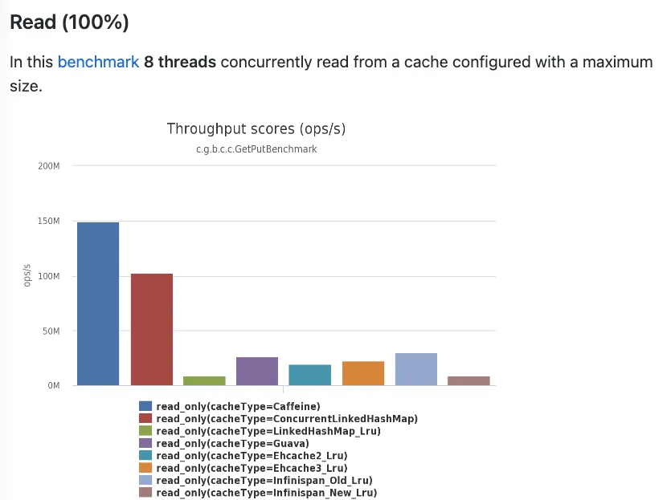
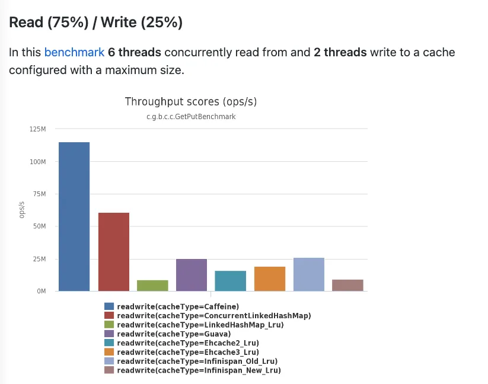
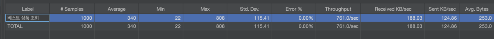
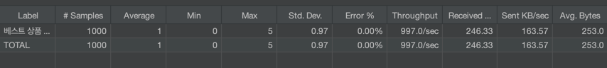
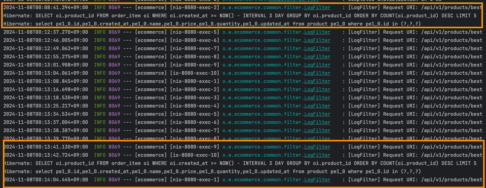
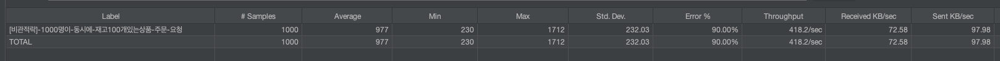
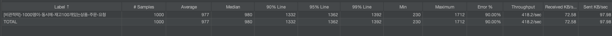
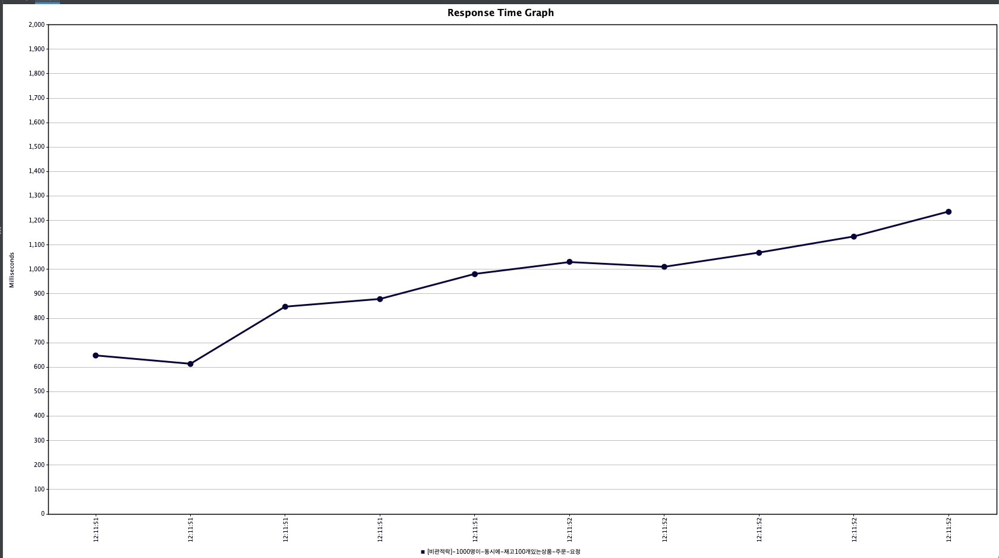

# e-commerce-server
- e-commerce 상품 주문 서비스 구현

#### 기술 스택
- Java 23, Spring Boot 3.3.4, Gradle, Mysql, JPA

<details>
    <summary>캐시 처리 보고서</summary>

### 1. 개요
- 조회 시간이 오래 걸리는 쿼리를 분석하여 캐싱을 통해 성능을 최적화 하고자 한다. 
- 캐싱이 필요한 쿼리와 스프링부트 인메모리 캐시를 통한 성능 개선 방안을 제시하여 효율적인 개선을 해본다
- 또한, 다중 인스턴스 환경에서도 인메모리 캐시로 일관성 유지가 가능한 이유와 제한 사항을 설명한다

### 2. 베스트 상품 조회 API 캐싱 적용
2.1 API 개요
- API 기능: 베스트 상품 조회 API는 주문 개수를 기준으로 상위 5개의 상품 통계 데이터를 조회하여 반환한다.
- 사용 위치: 베스트 상품 영역은 메인 페이지에 배치되어 있어, 사용자들이 페이지를 방문할 때마다 호출될 가능성이 높다.

2.2 캐싱 적용 이유
- 트래픽 부담 완화: 메인 페이지에 공통적으로 노출되는 영역이기 때문에 API 호출 빈도가 높아질 가능성이 크다. 이를 통해 불필요한 데이터베이스 부하를 줄일 수 있다.
- 실시간 정확도 요구 사항 완화: 베스트 상품 영역은 반드시 매 초마다 실시간 데이터로 보여줄 필요가 없다고 가정한다. 따라서 약간의 시차가 발생해도 사용자 경험에 큰 영향을 미치지 않으므로, 5분 주기로 데이터를 갱신해도 충분히 요구 사항을 충족할 수 있다.
- 효율적인 리소스 사용: 캐싱을 통해 동일한 데이터 요청을 줄임으로써 서버 자원의 효율성을 높이고 응답 속도를 개선한다.

2.3 캐싱 적용 방안
- 캐시 저장소: Spring Boot의 인메모리 캐시를 사용하여 캐싱 데이터를 저장한다. 다중 인스턴스 환경에서도 일정 수준의 일관성을 유지하도록 TTL을 설정하고, 약간의 시차를 허용하여 데이터를 갱신한다.
> 스프링에서 로컬 캐시 구현을 위해 여러가지 옵션(ConcurrentHashMap, Caffeine, ehcache, Guava 등)이 있는데 그 중에서 caffeine 라이브러리를 선택했다.
> 
> **선택 근거** 
> 
> 스프링에서 기본으로 사용되는 캐시는 ConcurrentMapCache인데 TTL 설정을 위해서는 직접 구현해야 한다. 오로지 TTL 구현 때문에 caffeine 라이브러리를 선택하고 싶지 않았으나 성능 차이도 크게 있어 caffeine을 선택했다. 
> 
> 
- TTL(Time-to-Live): 5분으로 설정하여 데이터가 5분마다 갱신되도록 한다. 이 주기는 서버 리소스 최적화와 사용자 경험을 균형 있게 맞추기 위해 설정되었다.

2.4 외부의 중앙 캐시를 사용하지 않고 인메모리 캐시를 사용한 이유

**1. 데이터 실시간 정확도에 대한 요구가 낮음**
- 베스트 상품과 같은 데이터는 최신성이 요구되지만 완전한 실시간 일관성이 필요하지 않기 때문에, TTL을 설정한 인메모리 캐시로도 충분히 성능을 향상할 수 있다.

**2. 외부 의존성 최소화 및 비용 절감**
- Redis같은 외부 분산 캐시 서버를 추가로 도입할 경우 운영 비용이 증가하고, 인프라 관리도 복잡해진다.

**3. 낮은 시스템 부하와 간단한 구성 요구**
- 인메모리 캐시는 빠르게 접근할 수 있어 간단한 구성으로도 높은 성능을 제공할 수 있다.
- 특히 다중 인스턴스에서 트래픽 부하가 낮거나 캐시 데이터 일관성에 민감하지 않은 경우, 별도의 분산 캐시를 도입하는 것보다 인메모리 캐시로 성능을 높이는 것이 더 실용적이다.

**4. 캐시 갱신 주기를 통한 자연스러운 데이터 동기화**
- 인메모리 캐시에 TTL을 5분으로 설정하여 데이터가 주기적으로 갱신되도록 하면, 데이터 동기화 문제를 어느 정도 해결할 수 있다.
- 각 인스턴스가 독립적으로 캐싱하고, TTL로 자동 갱신을 적용하므로 데이터가 일관되게 갱신된다. 이 방식은 다중 인스턴스 환경에서 데이터 일관성 유지의 간단한 방법으로, 캐시 동기화 요구가 낮은 시스템에 효과적이다.

2.5 성능
> JMeter 부하테스트 도구를 활용해서 성능을 측정했음 

시나리오: 1000명이 1초 안에 1000번 베스트 상품 조회 API 요청
- 캐싱 적용 전
    - 최대 응답 시간 808ms
    - 평균 응답 시간 340ms
    - 1000번의 데이터베이스 부하

- 캐싱 적용 후
  - 최대 응답 시간 5ms
  - 평균 응답 시간 1ms
  - 데이터베이스 부하 감소


### 3. 성능 개선 효과 분석
- 기대 효과: 캐싱 적용으로 인한 응답 시간 단축과 함께, API 호출 빈도 감소로 데이터베이스의 부하가 줄어들어 시스템 전체 성능이 개선될 것으로 예상된다. 이를 통해 사용자에게 더 빠르고 안정적인 서비스 경험을 제공할 수 있다.
- 약간의 데이터 시차 허용: 5분 TTL을 설정한 인메모리 캐시 사용으로 인해 인스턴스 간 데이터 갱신이 완벽히 일치하지 않더라도, 실시간 정확도가 크게 요구되지 않는 서비스 특성상 사용자 경험에 문제를 일으키지 않는다.

### 4. 결론 및 향후 계획
- 본 보고서에서는 베스트 상품 조회 API에 인메모리 캐싱을 적용하여 성능을 개선하는 방안을 제시했다. 추후 실제 성능 지표를 확인하고 필요시 TTL 주기를 조정하거나 다른 캐싱 전략(예: 분산 캐시, 메시지 브로커 활용)을 검토할 예정이다.

</details>

<details>
    <summary>주문 API 동시성 처리</summary>

### 시나리오: [주문] 1000명이 재고 100개 있는 상품 동시 구매 요청
- 1000명이 재고 100개 있는 상품을 동시에 구매 요청하는 상황은 "**충돌이 빈번하게**" 일어나는 상황이기 때문에 비관적락으로 구현했다.
  - **만약에 낙관적락으로 구현하면?**
    - 최초 커밋 1명은 통과하고 버전을 변경한다. 
    - 그리고 이후의 남은 999명은 업데이트 시점에 버전이 변경됐기 때문에 취소되고 애플리케이션 오류 처리 로직에 따라 다시 재시도 요청을 해야한다. 
    - 그리고 다음 한 명이 요청을 처리하게 되고 남은 998명은 다시 새로운 버전을 읽고 재시도를 해야한다... (반복)
- 비관적락이 정상적으로 걸려 오차 없이 90% 실패한 걸 확인할 수 있었음

### 비관적락
summary report 


aggregate report


response time graph



### 낙관적락과 비관적락 그리고 분산락
"동시에 데이터를 수정하는 일이 빈번하게 일어나는가?"
- 일반적으로 적다면 낙관적락, 많다면 비관적락을 사용한다
  - 낙관적락으로 우선 구현하고 충돌이 많이 발생한다면 비관적락
  - 그리고 분산 환경에서의 문제, DB 부하의 의존성을 줄이기 위해 Zookeeper, Redis를 이용한 분산락을 고려할 수 있음

#### 낙관적락
- 충돌이 적다는 가정 하에 데이터 접근 시 잠금을 걸지 않음. 대신 데이터 업데이트할 때 버전 정보를 비교해서 충돌이 발생 했는지 확인한다.
- **낙관적락은 단순히 충돌을 감지할 뿐이다.**
  - 동시 요청이 왔을 때 최초 커밋 외에 그 이후 커밋도 반영되어야 한다면 추가적인 핸들링이 필요하다.
- 장점
  - 데이터베이스 레벨에서의 락인 비관적락과는 달리 낙관적락은 애플리케이션 레벨에서의 락이기 때문에 성능적인 측면에서 이점이 있음
- 단점
  - 재시도 로직을 직접 작성해야 함
  - 충돌이 많아짐에 따라 비용이 증가한다.
    - 충돌이 빈번하게 일어나는 상황에서 낙관적락을 사용하게 된다면 모든 요청이 완료될 때까지 재시도를 수행한다. 따라서 데이터베이스에 많은 요청을 보내게 된다.
    - 충돌이 많아짐 -> race condition(둘 이상의 스레드가 데이터에 접근함으로써 생기는 문제)이 빈번하게 발생하는 것을 의미

#### 비관적락
- 출돌이 발생할 확률이 높다고 가정하고 데이터에 액세스 하기 전에 먼저 락을 걸어 충돌을 예방하는 방식
- DB 트랜잭션을 이용해서 충돌을 예방하는 것
- 트랜잭션이 시작될 때 데이터베이스 레벨에서 shared lock 또는 exclusive lock을 걸고 시작하는 방법
  - shared lock이 잡혀 있으면?
    - a 트랜잭션에서 shared lock을 먼저 잡았다면 b 트랜잭션에서는 수정하지 못함
      - a 트랜잭션이 종료(commit)되어야 b 트랜잭션에서 수정할 수 있음
  - exclusive lock이 잡혀 있으면?
    - a 트랜잭션에서 exclusive lock을 먼저 잡았다면 b 트랜잭션이서는 읽지도 못함
      - a 트랜잭션이 종료(commit)되어야 b 트랜잭션에서 읽을 수 있음
- 장점
  - 데이터에 대한 접근을 제어하기 때문에 데이터의 일관성과 무결성을 강력하게 보장할 수 있다
- 단점
  - 데이터베이스 락 자체가 비용이다.
  - 잠금을 설정한 상태에서 해당 트랜잭션의 작업이 오래 걸리면 다른 트랜잭션들이 대기하게 되어 시스템 성능이 저하될 수 있다.

#### 분산락
- 분산 환경에서 여러 대의 서버와 여러 데이터베이스 간의 동시성을 관리하는데 사용(분산 환경에서만 사용할 수 있는 건 아님)
- 왜 분산 환경에서 비관적락보다는 분산락을 쓰는 게 효과적일까?
  - 성능 저하: 분산된 서버와 네트워크 사이에 비관적 락을 사용하면 락 설정 및 해제 과정이 지연될 수 있어 성능이 저하될 수 있다. 
  - 데드락: 한 서버가 락을 걸고 다른 서버들도 동일한 데이터에 접근하려 하면 서로 기다리면서 멈추는 데드락이 발생할 수 있다.
  - 네트워크 문제: 네트워크가 일시적으로 끊기는 경우, 한 서버가 락을 걸어도 다른 서버는 모를 수도 있다. 이로 인해 동시에 같은 데이터를 수정하게 되어 데이터 불일치 문제가 발생할 수 있다.
</details>

<details>
    <summary>Redis로 성능 개선</summary>

- 재고 조회 시 비관적락이 걸려 있어 대기 시간이 발생하고, 데이터베이스 부하 문제가 있음
- 따라서 상품 재고 정보를 캐싱 처리를 하고 비관적락에서 분산락으로 개선해보려고 한다.
- Redis를 활용함으로써 멀티 인스턴스 환경에서도 재고 관리가 되고, 데이터베이스 부하도 많이 줄 것으로 예상이 된다. 

</details> 

<details>
    <summary>요구사항</summary>

### Requirements
- 아래 4가지 API 구현
    - 포인트 충전 / 조회 API
    - 상품 조회 API
    - 주문 / 결제 API
    - 인기 판매 상품 조회 API
- 단위 테스트 작성 
- 멀티 인스턴스 환경 및 동시성 이슈 고려 

### API Specs

1️⃣**잔액 충전 / 조회 API**
- 결제에 사용될 금액을 충전하는 API 를 작성한다
- 사용자 식별자 및 충전할 금액을 받아 잔액을 충전한다
- 사용자 식별자를 통해 해당 사용자의 잔액을 조회한다

2️⃣**상품 조회 API**
- 상품 정보 ( ID, 이름, 가격, 잔여 수량 )을 조회하는 API 를 작성한다
- 조회 시점의 상품 별 잔여 수량이 정확해야 한다

3️⃣**주문 / 결제 API**
- 사용자 식별자와 (상품 ID, 수량) 목록을 입력 받아 주문하고 결제를 수행하는 API 를 작성한다
- 결제는 기 충전된 잔액을 기반으로 수행하며 성공할 시 잔액을 차감해야 한다
- 데이터 분석을 위해 결제 성공 시에 실시간으로 주문 정보를 데이터 플랫폼에 전송한다

4️⃣**상위 상품 조회 API**
- 최근 3일간 가장 많이 팔린 상위 5개 상품 정보를 제공하는 API 를 작성한다

5️⃣**장바구니 관리**
- 사용자는 구매 이전에 관심 있는 상품들을 장바구니에 추가할 수 있다
- 사용자는 장바구니 조회 및 장바구니에 담긴 상품을 삭제할 수 있다
</details>


<details>
    <summary>Milestone</summary>


### 1주차(2024-10-6~2024-10-11)
[issue1: 프로젝트 시작 및 초기 설정](https://github.com/wisdom08/ecommerce/issues/1#issue-2578965010)
- 요구사항 정리 및 마일스톤 작성
- 시퀀스 다이어그램
- ERD 설계
- 스웨거 셋팅 및 API 명세 작성
- mock API 작성
### 2주차(2024-10-12~2024-10-18)
[issue2: 기능 구현](https://github.com/wisdom08/ecommerce/issues/2#issue-2578965698)
- 포인트 조회/충전 API
- 상품 정보 조회 API
- 포인트 기반으로 하는 상품 주문 API
- 인기 판매 상품 조회 API
- 장바구니 조회/추가/삭제 API

### 3주차(2024-10-19~2024-10-25)
[issue3: 기능 고도화 및 리팩토링](https://github.com/wisdom08/ecommerce/issues/3#issue-2578965908)
- 주문 정보 -> 데이터 플랫폼(애플리케이션 외부)로 전송
- 동시에 여러 주문이 들어왔을 때 유저의 보유 잔고에 대한 동시성 처리
- 각 상품의 재고 관리가 정상적으로 이루어져서 잘못된 주문이 발생하지 않도록 처리
- 조회 시점의 상품 별 잔여 수량이 정확하도록 처리

</details>


<details>
    <summary>Use Cases</summary>


</details>


<details>
    <summary>Sequence Diagram</summary>

### 포인트


### 상품


### 주문 결제


### 장바구니


</details>


<details>
    <summary>ERD</summary>


</details>


<details>
    <summary>API 명세</summary>

OpenAPI: http://localhost:8080/docs


### 공통 api path
- `/api/v1/`

## 상품 /products

### 상품 조회 GET /{productId}
- response
```json
{
  "productId": 1,
  "name": "MOCK_PRODUCT_1",
  "price": 100000,
  "stock": 100
}
```

### 인기 상품 조회 GET /best
- response
```json
[
  {
    "productId": 1,
    "name": "MOCK_PRODUCT_1",
    "price": 100000,
    "stock": 100
  },
  {
    "productId": 1,
    "name": "MOCK_PRODUCT_2",
    "price": 200000,
    "stock": 200
  }
]
```

---

## 장바구니 /carts

### 장바구니 삭제 DELETE /{cartId}
- request
```json
{
  "userId": 2,
  "cartId": 2
}
```
- response: 장바구니에 담긴 상품 중 선택한 상품 제거 후 남은 장바구니 정보 반환
```json
[
  {
    "userId": 2,
    "productId": 1,
    "cartId": 1,
    "productName": "MOCK_PRODUCT_NAME_1",
    "quantity": 1
  }
]
```

### 장바구니 추가 PATCH /{productId}
- response: 장바구니에 상품 추가 후 전체 장바구니 정보 반환
```json
[
  {
    "userId": 1,
    "productId": 1,
    "cartId": 1,
    "productName": "MOCK_PRODUCT_NAME_1",
    "quantity": 1
  },
  {
    "userId": 2,
    "productId": 2,
    "cartId": 2,
    "productName": "MOCK_PRODUCT_NAME_2",
    "quantity": 2
  },
  {
    "userId": 3,
    "productId": 5,
    "cartId": 3,
    "productName": "MOCK_PRODUCT_NAME_3",
    "quantity": 3
  }
]
```

### 장바구니 조회 GET /{userId}
- response
```json
[
  {
    "userId": 1,
    "productId": 1,
    "cartId": 1,
    "productName": "MOCK_PRODUCT_NAME_1",
    "quantity": 1
  },
  {
    "userId": 1,
    "productId": 2,
    "cartId": 2,
    "productName": "MOCK_PRODUCT_NAME_2",
    "quantity": 2
  }
]
```

---

### 주문/결제 PATCH /points
- request
```json
{
  "userId": 0,
  "productId": 0
}
```
- response
```json
{
  "userId": 0,
  "productId": 0,
  "orderId": 1,
  "totalAmount": 10
}

```

--- 

### 포인트 조회
- GET /points/{userId}
- response
```json
{
  "userId": 0,
  "pointToCharge": 0
}
```

- response

### 포인트 충전
- PATCH /points/{userId}
- request
```json
{
  "userId": 0,
  "pointToCharge": 0
}
```
- response
```json
{
  "userId": 0,
  "totalPoint": 0
}
```

---
</details>