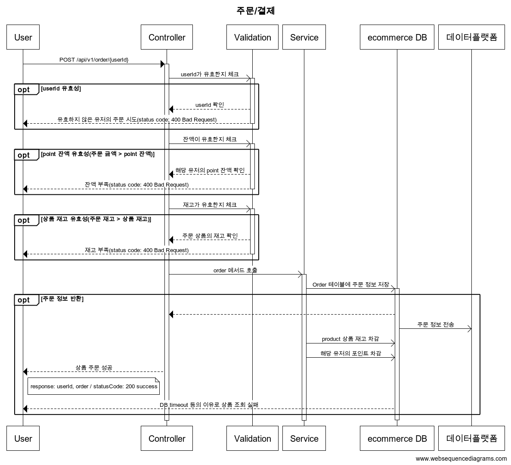

# e-commerce-server
- e-commerce 상품 주문 서비스 구현

#### 기술 스택
- Java 23, Spring Boot 3.3.4, Gradle, Mysql, JPA

<details>
    <summary>요구사항</summary>

### Requirements
- 아래 4가지 API 구현
    - 포인트 충전 / 조회 API
    - 상품 조회 API
    - 주문 / 결제 API
    - 인기 판매 상품 조회 API
- 단위 테스트 작성 
- 멀티 인스턴스 환경 및 동시성 이슈 고려 

### API Specs

1️⃣**잔액 충전 / 조회 API**
- 결제에 사용될 금액을 충전하는 API 를 작성한다
- 사용자 식별자 및 충전할 금액을 받아 잔액을 충전한다
- 사용자 식별자를 통해 해당 사용자의 잔액을 조회한다

2️⃣**상품 조회 API**
- 상품 정보 ( ID, 이름, 가격, 잔여 수량 )을 조회하는 API 를 작성한다
- 조회 시점의 상품 별 잔여 수량이 정확해야 한다

3️⃣**주문 / 결제 API**
- 사용자 식별자와 (상품 ID, 수량) 목록을 입력 받아 주문하고 결제를 수행하는 API 를 작성한다
- 결제는 기 충전된 잔액을 기반으로 수행하며 성공할 시 잔액을 차감해야 한다
- 데이터 분석을 위해 결제 성공 시에 실시간으로 주문 정보를 데이터 플랫폼에 전송한다

4️⃣**상위 상품 조회 API**
- 최근 3일간 가장 많이 팔린 상위 5개 상품 정보를 제공하는 API 를 작성한다

5️⃣**장바구니 관리**
- 사용자는 구매 이전에 관심 있는 상품들을 장바구니에 추가할 수 있다
- 사용자는 장바구니 조회 및 장바구니에 담긴 상품을 삭제할 수 있다
</details>


<details>
    <summary>Milestone</summary>


### 1주차(2024-10-6~2024-10-11)
[issue1: 프로젝트 시작 및 초기 설정](https://github.com/wisdom08/ecommerce/issues/1#issue-2578965010)
- 요구사항 정리 및 마일스톤 작성
- 시퀀스 다이어그램
- ERD 설계
- 스웨거 셋팅 및 API 명세 작성
- mock API 작성
### 2주차(2024-10-12~2024-10-18)
[issue2: 기능 구현](https://github.com/wisdom08/ecommerce/issues/2#issue-2578965698)
- 포인트 조회/충전 API
- 상품 정보 조회 API
- 포인트 기반으로 하는 상품 주문 API
- 인기 판매 상품 조회 API
- 장바구니 조회/추가/삭제 API

### 3주차(2024-10-19~2024-10-25)
[issue3: 기능 고도화 및 리팩토링](https://github.com/wisdom08/ecommerce/issues/3#issue-2578965908)
- 주문 정보 -> 데이터 플랫폼(애플리케이션 외부)로 전송
- 동시에 여러 주문이 들어왔을 때 유저의 보유 잔고에 대한 동시성 처리
- 각 상품의 재고 관리가 정상적으로 이루어져서 잘못된 주문이 발생하지 않도록 처리
- 조회 시점의 상품 별 잔여 수량이 정확하도록 처리

</details>


<details>
    <summary>Use Cases</summary>


</details>


<details>
    <summary>Sequence Diagram</summary>

### 포인트


### 상품


### 주문 결제


### 장바구니


</details>


<details>
    <summary>API 명세</summary>

OpenAPI: http://localhost:8080/docs


### 공통 api path
- `/api/v1/`

## 상품 /products

### 상품 조회 GET /{productId}
- response
```json
{
  "productId": 1,
  "name": "MOCK_PRODUCT_1",
  "price": 100000,
  "stock": 100
}
```

### 인기 상품 조회 GET /best
- response
```json
[
  {
    "productId": 1,
    "name": "MOCK_PRODUCT_1",
    "price": 100000,
    "stock": 100
  },
  {
    "productId": 1,
    "name": "MOCK_PRODUCT_2",
    "price": 200000,
    "stock": 200
  }
]
```

---

## 장바구니 /carts

### 장바구니 삭제 DELETE /{cartId}
- request
```json
{
  "userId": 2,
  "cartId": 2
}
```
- response: 장바구니에 담긴 상품 중 선택한 상품 제거 후 남은 장바구니 정보 반환
```json
[
  {
    "userId": 2,
    "productId": 1,
    "cartId": 1,
    "productName": "MOCK_PRODUCT_NAME_1",
    "quantity": 1
  }
]
```

### 장바구니 추가 PATCH /{productId}
- response: 장바구니에 상품 추가 후 전체 장바구니 정보 반환
```json
[
  {
    "userId": 1,
    "productId": 1,
    "cartId": 1,
    "productName": "MOCK_PRODUCT_NAME_1",
    "quantity": 1
  },
  {
    "userId": 2,
    "productId": 2,
    "cartId": 2,
    "productName": "MOCK_PRODUCT_NAME_2",
    "quantity": 2
  },
  {
    "userId": 3,
    "productId": 5,
    "cartId": 3,
    "productName": "MOCK_PRODUCT_NAME_3",
    "quantity": 3
  }
]
```

### 장바구니 조회 GET /{userId}
- response
```json
[
  {
    "userId": 1,
    "productId": 1,
    "cartId": 1,
    "productName": "MOCK_PRODUCT_NAME_1",
    "quantity": 1
  },
  {
    "userId": 1,
    "productId": 2,
    "cartId": 2,
    "productName": "MOCK_PRODUCT_NAME_2",
    "quantity": 2
  }
]
```

---

### 주문/결제 PATCH /points
- request
```json
{
  "userId": 0,
  "productId": 0
}
```
- response
```json
{
  "userId": 0,
  "productId": 0,
  "orderId": 1,
  "totalAmount": 10
}

```

--- 

### 포인트 조회
- GET /points/{userId}
- response
```json
{
  "userId": 0,
  "pointToCharge": 0
}
```

- response

### 포인트 충전
- PATCH /points/{userId}
- request
```json
{
  "userId": 0,
  "pointToCharge": 0
}
```
- response
```json
{
  "userId": 0,
  "totalPoint": 0
}
```

--- 


</details>